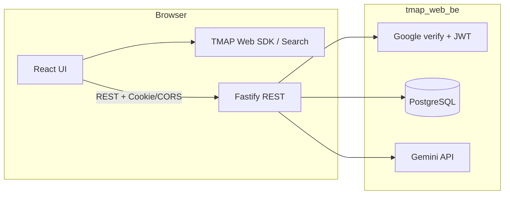

# TMAP 공개 API를 이용한 즐겨찾기 모음 공유 및 의견교환 웹 — 소개

이 문서는 **제품 관점**에서 이 서비스가 무엇인지, **현재 사용자에게 어떤 가치를 주는지**, 그리고 **프론트엔드와 백엔드가 어떻게 맞물리는지**를 정리합니다. 포트폴리오용으로, PM이 스스로 프로토타입을 구현했을 때 **어떤 새로운 가치를 전달할 수 있는지**를 설명하는 것이 목적입니다.

만약 PM으로서 서비스 기획 포트폴리오를 보시고자 한다면 아래 링크를 참조해 주세요:
https://drive.google.com/file/d/1xf9Xizm7eRwnPGQuufYymuZXrYPnBhSe/view?usp=sharing 

관련 저장소는 다음과 같습니다.

- 프론트엔드: [JaeAn0715/tmap_web_fe](https://github.com/JaeAn0715/tmap_web_fe) — TMAP OpenAPI·Web SDK 기반 POI 검색·지도·즐겨찾기 모음 UI (Vite + React + TypeScript)입니다.
- 백엔드: **tmap_web_be** (본 저장소) — 인증, 즐겨찾기 모음·공유 코멘트·좋아요 영속화, 서버 사이드 AI 등을 담당합니다.

---

## 1. 어떤 서비스인가

**한 줄로 말하면**, 티맵 지도 위에서 장소(POI)를 찾고 모은 뒤 **즐겨찾기 모음**으로 묶어 저장·공유하고, 함께 보는 사람들이 **좋아요·코멘트**로 의견을 남길 수 있는 반응형 웹 서비스입니다.

검색 결과·추천 목적지·즐겨찾기 모음·POI 상세가 **사이드 패널** 안에서 이어지고, 지도는 **탐색과 맥락**, 패널은 **목록·비교·실행 가능한 액션**을 맡는 구조입니다.

로그인한 사용자에게는 POI 상세의 **AI 요약**이, 그 사람이 **여러 장소에 남긴 코멘트**에서 추려 낸 **관심사(예: 주차·유아 동반 등)**를 바탕으로 **어느 관점을 앞에 둘지**를 맞춥니다. 코멘트 원문은 화면 요약에 그대로 실리지 않고, 장소 메타와 함께 **일반 방문자 톤의 장단점**으로만 전달됩니다. 단계와 기술적 제약은 **2.1절**에서 이어집니다.

---

## 2. 사용자에게 주는 가치

### 2.1 LLM으로 「관심사 → 맞춤 리뷰 톤」을 만드는 방식

POI 상세에서 보여 주는 **한국어 장점·단점 요약**은, 단순히 그 장소만 보고 쓰는 문장이 아니라 **이 사용자가 여러 장소에 남긴 코멘트 전체**에서 뽑은 **관심 축**을 반영하도록 설계되어 있습니다. 흐름은 대략 다음과 같습니다.

1. **전역 코멘트 코퍼스**  
   로그인한 사용자라면 DB에서 **즐겨찾기 모음 공유 코멘트(`ClusterNote`)**와 **POI 개인 코멘트(`PoiPersonalNote`)**를 모아 한 덩어리의 텍스트 코퍼스를 만듭니다(`src/services/user-interest-corpus.ts`). 이 코퍼스는 **「이 사람이 목적지를 고를 때 무엇을 중시하는가」**를 추정하는 데만 쓰입니다.

2. **1단계 — 관심사를 명사형으로 압축**  
   위 코퍼스를 Gemini에 넣어 **명사·명사구**만 리스트로 뽑습니다(예: 주차, 유모차, 웨이팅 등). 코퍼스가 비어 있으면 프론트가 넘긴 **검색·의도 힌트**만으로 같은 방식의 추출을 시도합니다.

3. **2단계 — 리뷰 관점(angles)**  
   뽑힌 관심 명사와 힌트를 바탕으로, **이 사용자가 리뷰를 읽을 때 특히 확인하고 싶어 할 관점**을 몇 개의 짧은 문장으로 만듭니다.

4. **3단계 — 지금 보고 있는 POI에 대한 pros / cons / highlightTerms**  
   TMAP이 주는 **이 POI의 메타**(이름·주소·업종 등)와 위 관점을 합쳐, **장점·단점 요약**과 UI에서 강조할 **짧은 구절 목록**을 JSON으로 생성합니다. 이때 **현재 POI에만 달린 사용자 코멘트 원문**은, **어느 주제를 앞에 두고 쓸지**를 잡는 **내부 신호**로만 쓰이며, **최종 문장에 인용·복사되지 않도록** 프롬프트로 막고, 괄호 속 메타 문구 등은 후처리로 걷어 냅니다(`src/lib/gemini-server.ts`).

정리하면, **코멘트는 「관심사 추출」과 「이 장소에서 무엇을 우선 서술할지」의 재료**이고, 화면에 나가는 문구는 **일반 방문자에게 말하는 톤의 요약**으로 유지하는 것이 목표입니다. 기술 면접이나 포트폴리오에서는 **「전역 맥락으로 개인화 + 노출 텍스트에서 원문 분리」**라는 한 줄로 설명하실 수 있습니다.

### 2.2 의사결정을 함께 만듭니다

주말 약속·회식·데이트처럼 **「여기 갈까?」**를 정할 때, 한 사람이 검색해 본 여러 곳을 **그대로 한 묶음**으로 공유할 수 있습니다. 수신자는 링크만으로 **같은 POI 목록과 지도 맥락**을 볼 수 있고, 로그인한 상태에서는 **좋아요·공유 코멘트**로 반응할 수 있습니다(정책 상세는 [backend_requirement.md](./backend_requirement.md)와 맞춰 두었습니다).

### 2.3 「지도 앱」과 「목록 협업」 사이를 잇습니다

POI 정보는 TMAP이 준 **스냅샷(JSON)**으로 모음에 저장되므로, 나중에 열어도 **당시 POI목록**이 유지됩니다. 단일 즐겨찾기와 달리 **POI 목록과 협업 피드백**이 한 객체로 묶입니다.

### 2.4 공개 협업과 개인 기록을 나눕니다

**즐겨찾기 모음 안의 코멘트**는 공유 맥락에서 여러 사용자가 볼 수 있는 협업 레이어입니다. 따라서 즐겨찾기 목록을 많은 인원과 공유하여 약속장소를 정하거나, 자신만이 알고있는 맛집 리스트를 효과적으로 공유하여 다른 사용자의 의견을 받는데 용의합니다. **특정 POI에만 붙는 개인 코멘트**는 본인만 보는 레이어로, 백엔드에서 별도 API로 다룹니다.

### 2.5 AI는 브라우저 밖에서 동작합니다

프론트엔드 [tmap_web_fe](https://github.com/JaeAn0715/tmap_web_fe)는 `VITE_API_BASE_URL`이 설정되면 **API 모드**로 동작하며, Gemini 호출은 **로그인 후 Bearer 토큰**으로 백엔드에만 전달됩니다(프론트 `raedme.me`에 정리된 기술 전제와 동일합니다). API 키는 서버에만 두고, 대표적으로 **`POST /ai/gemini/poi-review-summary`**(장단점·하이라이트), **`POST /ai/poi-photo`**(장소 이미지 URL 후보) 등이 있습니다.

---

## 3. PM·프로토타입 관점에서의 한 줄

티맵이 주는 검색·지도 위에 **「후보 묶음 + 공유 + 가벼운 합의(좋아요·코멘트) + 서버에서 보호되는 AI」**를 얹어, 그룹 의사결정에 걸리는 시간을 줄이는 웹 경험을 목표로 합니다. 네이티브 앱 설치 없이 URL로 열 수 있고, **요구사항 문서 → 프론트 mock → 백엔드 API 계약**까지 한 흐름으로 프로토타입을 설명할 수 있게 쪼개 두었습니다.

---

## 4. 시스템 구조: 프론트엔드와 백엔드

### 4.1 책임 분리

| 영역 | 주로 하는 일 |
|------|----------------|
| **브라우저 (FE)** | TMAP Web SDK·검색·추천 POI, 지도 카메라·핀, 사이드 패널 UI, `VITE_API_BASE_URL` 미설정 시 localStorage mock |
| **서버 (BE)** | Google ID 토큰 검증 → JWT, 즐겨찾기 모음 CRUD, POI별 좋아요·공유 코멘트, 개인 POI 코멘트, Gemini 프록시(`POST /ai/...`) |
| **DB** | PostgreSQL + Prisma(사용자, 즐겨찾기 모음, 멤버십, 코멘트·좋아요 등) |

지도 타일과 POI 검색의 **원천 호출**은 원칙적으로 클라이언트가 TMAP에 직접 합니다. 백엔드는 **사용자가 만든 도메인 데이터**(모음, 피드백, 세션)와 LLM을 트리거하는 기능을 맡습니다.

### 4.2 요청 흐름 (개념도)

로그인은 프론트가 GIS로 받은 `credential`을 `POST /auth/google` 등으로 보내고, 백엔드가 JWT를 발급합니다. 이후 요청은 보통 `Authorization: Bearer`를 사용합니다. 즐겨찾기 모음의 `GET /clusters/:id`는 **공유 링크 열람**을 위해 비로그인 접근을 허용하는 설계이며, 생성·이름·지도 메타·POI 편집·삭제는 **소유자(로그인)** 중심입니다. CORS는 `credentials: true`로 프론트 오리진을 허용하도록 구성되어 있습니다(`src/app.ts`).

### 4.3 백엔드 라우트 구성(본 저장소)

`src/app.ts`에 등록된 단위로 보면 다음과 같습니다.

- `auth` — Google 로그인·로그아웃·JWT
- `me` — 내 프로필, **내 즐겨찾기 모음 목록**(소유 + 구독)
- `clusters` — 즐겨찾기 모음 CRUD, 포크, POI별 좋아요·공유 코멘트
- `poi-personal-notes` — POI 단위 개인 코멘트
- `ai` — `poi-review-summary`, `poi-photo` 등(Gemini 키는 서버만 보유)
- `demo-baby-ai` — `POST /demo/baby-ai-summary-seed`(Bearer 필수, 로그인 사용자에만 시드 연결)

상세 계약은 [docs/openapi.yaml](./docs/openapi.yaml)과 [docs/api-auth-rules.md](./docs/api-auth-rules.md)에서 확인하실 수 있습니다.

### 4.4 프론트엔드와 연결할 때

프론트 [tmap_web_fe](https://github.com/JaeAn0715/tmap_web_fe)의 `raedme.me`에 적힌 대로, **`VITE_API_BASE_URL`이 있으면** 즐겨찾기 모음·인증·AI가 API 모드로 붙습니다. 프로토타입을 돌릴 때는 (1) **tmap_web_be**를 띄우고, (2) 프론트 `.env`에 API 베이스 URL과 Google Web Client ID(백엔드 `GOOGLE_CLIENT_ID`와 동일)를 맞추고, (3) 백엔드 `.env`에 `DATABASE_URL`, `JWT_SECRET`, `GOOGLE_CLIENT_ID`, `GEMINI_API_KEY` 등을 채우면 됩니다(예시는 [.env.example](./.env.example)입니다). 이렇게 하면 **지도는 TMAP, 상태는 우리 서버**에 가까운 슬라이스를 데모로 보여줄 수 있습니다.

---

## 5. 제품·UX의 변천

초기 기획과 현재 구현 사이에, **이름과 화면 구조**를 바꾼 이유를 짧게 남깁니다.

### 5.1 「클러스터」에서 「즐겨찾기 모음」으로 바꾼 이유

처음에는 **링크를 쉽게 공유하고 코멘트·좋아요를 모으는 묶음**을 **클러스터**라는 이름으로 기획했습니다. 그러나 이미 **공유·저장**에 가깝게 쓰이는 **즐겨찾기** 멘탈모델이 있다는 점을 파악했습니다. 새 이름을 또 얹기보다 **기존에 익숙한 즐겨찾기 모음**에 가깝게 맞추는 편이, 기능을 처음 만나는 사용자에게 더 쉽다고 판단하여 **즐겨찾기 모음**이라는 제품 언어로 통일했습니다.

### 5.2 「스티키 노트」에서 「사이드 패널」로 바꾼 이유

지도 위에서 POI 정보를 스티키 노트처럼 옮기며 비교하는 구상은, **지도 안에서 필수 정보를 동시에 본다**는 점에서 매력적이었습니다. 다만 실제로는 **줌인·줌아웃과 드래그 가능한 카드가 서로 방해**가 되었고, 지도 SDK 위에 얹는 **지나치게 특이한 UI**는 익숙해지기까지 비용이 크다고 보았습니다. 그래서 검색·목록·상세는 **사이드 패널**로 모으고, 지도는 탐색과 핀 중심으로 두는 쪽으로 단순화했습니다.

---

## 6. 코드·API에서 보이는 과거 용어

제품 문서와 화면에서는 **즐겨찾기 모음·코멘트**를 쓰지만, **저장소와 API는 이미 `cluster`·`ClusterNote` 등으로 구현**되어 있습니다. 이유는 초기 도메인 모델을 그대로 옮겨 왔기 때문이며, 다음처럼 읽으면 됩니다.

- REST 경로의 `clusters`, Prisma의 `Cluster` 등 → **즐겨찾기 모음**과 같은 개념입니다.
- `ClusterNote`, OpenAPI상의 노트 관련 스키마 → **즐겨찾기 모음 안의 공유 코멘트**에 대응합니다.
- `PoiPersonalNote` 등 → **POI에 붙는 개인 코멘트(비공개)**에 대응합니다.

새 문서나 UI 카피를 쓸 때는 제품 언어를 우선하시고, 코드를 읽을 때만 위 매핑을 참고하시면 됩니다.

---

## 7. 마무리

이 서비스의 핵심은 **지도 SDK를 붙인 것**에 그치지 않고, **후보 집합을 하나의 객체로 저장하고 사람들과 가볍게 합의를 쌓는 경험**을 웹으로 만든다는 점입니다. 백엔드는 그 경험을 **신뢰할 수 있는 데이터와 정책**으로 받쳐 주고, AI는 **키를 숨기면서도 개인화 힌트를 줄 수 있는 경계**를 서버 안에 두었습니다.

프론트엔드의 상세 UX는 [tmap_web_fe](https://github.com/JaeAn0715/tmap_web_fe)의 `raedme.me`를, 백엔드 요구·모델·정책은 본 저장소의 [backend_requirement.md](./backend_requirement.md)와 OpenAPI를 함께 보면 **기획 → 구현 → API 계약**이 한 줄로 이어집니다.
